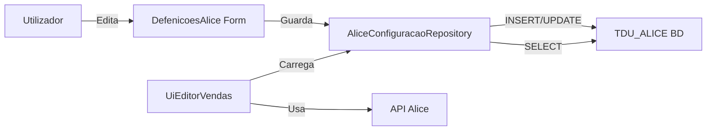

# Editor de Definições Alice

## Visão Geral

O **Editor de Definições Alice** permite configurar os parâmetros de conexão e comportamento do terminal de pagamento Alice diretamente através de uma interface gráfica, com os valores guardados na base de dados do PRIMAVERA.

## Tabela de Base de Dados

### TDU_ALICE

A tabela `TDU_ALICE` armazena todas as configurações do terminal Alice:

| Campo | Tipo | Descrição | Valor Padrão |
|-------|------|-----------|--------------|
| `CDU_id` | INT | Identificador único (chave primária) | Auto-incremento |
| `CDU_BASE_URL` | NVARCHAR(255) | URL base da API do terminal Alice | `https://192.168.1.83:8081/api` |
| `CDU_USER` | NVARCHAR(100) | Utilizador para autenticação na API | `8957_Admin` |
| `CDU_PASSWORD` | NVARCHAR(100) | Password para autenticação na API | `3603ee` |
| `CDU_POLLING_INTERNAL_MS` | INT | Intervalo de polling em milissegundos | `500` |
| `CDU_MAX_POLLING_TIME_MS` | INT | Tempo máximo de polling em milissegundos | `300000` (5 minutos) |

### Script de Criação da Tabela

Execute o script SQL localizado em: [`Scripts/CriarTabela_TDU_ALICE.sql`](Scripts/CriarTabela_TDU_ALICE.sql)

```sql
CREATE TABLE TDU_ALICE (
    CDU_id INT IDENTITY(1,1) PRIMARY KEY,
    CDU_BASE_URL NVARCHAR(255) NOT NULL DEFAULT 'https://192.168.1.83:8081/api',
    CDU_USER NVARCHAR(100) NOT NULL DEFAULT '8957_Admin',
    CDU_PASSWORD NVARCHAR(100) NOT NULL DEFAULT '3603ee',
    CDU_POLLING_INTERNAL_MS INT NOT NULL DEFAULT 500,
    CDU_MAX_POLLING_TIME_MS INT NOT NULL DEFAULT 300000
);
```

## Componentes Criados

### 1. Classes de Dados

#### [`AliceConfiguracao.cs`](ADAlicePOSv10/Data/AliceConfiguracao.cs)
Classe modelo que representa as configurações da Alice:
- Propriedades mapeadas diretamente para os campos da tabela
- Construtor com valores padrão

#### [`AliceConfiguracaoRepository.cs`](ADAlicePOSv10/Data/AliceConfiguracaoRepository.cs)
Repositório para acesso aos dados:
- `Carregar()`: Carrega configurações da base de dados
- `Guardar(AliceConfiguracao)`: Guarda/atualiza configurações na base de dados
- Proteção contra SQL injection com escape de aspas simples

### 2. Interface Gráfica

#### [`DefenicoesAlice.cs`](ADAlicePOSv10/DefenicoesAlice.cs) e [`DefenicoesAlice.Designer.cs`](ADAlicePOSv10/DefenicoesAlice.Designer.cs)
Formulário Windows Forms com:
- **Campo URL Base da API**: TextBox para configurar o endpoint da API
- **Campo Utilizador**: TextBox para o nome de utilizador
- **Campo Password**: TextBox com caracteres mascarados
- **Intervalo de Polling**: NumericUpDown (100-5000 ms)
- **Tempo Máximo de Polling**: NumericUpDown (30000-600000 ms)
- **Botão Guardar**: Valida e grava as configurações
- **Botão Cancelar**: Fecha sem guardar

### 3. Integração com UiEditorVendas

O ficheiro [`UiEditorVendas.cs`](ADAlicePOSv10/POS/UiEditorVendas.cs) foi atualizado para:
- Carregar configurações da base de dados no construtor
- Usar métodos auxiliares para obter valores de configuração:
  - `GetAliceBaseUrl()`
  - `GetAliceUser()`
  - `GetAlicePassword()`
  - `GetPollingInterval()`
  - `GetMaxPollingTime()`
- Fallback para valores padrão caso a base de dados esteja indisponível

## Como Usar

### 1. Instalação Inicial

1. **Criar a tabela na base de dados**:
   ```sql
   -- Execute o script Scripts/CriarTabela_TDU_ALICE.sql na base de dados do PRIMAVERA
   ```

2. **Compilar o projeto**:
   - Compilar a solução ADAlicePOSv10 em modo Release
   - Copiar `ADAlicePOSv10.dll` para `C:\Program Files\PRIMAVERA\SG100\APL\`

3. **Reiniciar o PRIMAVERA**:
   - Fechar e abrir novamente o ERP PRIMAVERA para carregar o módulo

### 2. Abrir o Editor de Definições

**Opção A: Programaticamente**

```csharp
using ADAlicePOSv10;
using ADAlicePOSv10.Data;

// Dentro de uma classe que herda de Editor do Primavera
var formConfig = new DefenicoesAlice(this.Extensibility);
if (formConfig.ShowDialog() == DialogResult.OK)
{
    MessageBox.Show("Configurações atualizadas com sucesso!");
}
```

**Opção B: Menu do PRIMAVERA**

Adicionar um item de menu personalizado no PRIMAVERA que chama o formulário DefenicoesAlice.

### 3. Configurar os Parâmetros

1. **URL Base da API**:
   - Formato: `https://IP:PORTA/api`
   - Exemplo: `https://192.168.1.83:8081/api`

2. **Utilizador e Password**:
   - Credenciais de autenticação Basic Auth do terminal Alice

3. **Intervalo de Polling**:
   - Frequência de verificação do estado do pagamento (em ms)
   - Valores típicos: 500-1000 ms
   - ⚠️ Valores muito baixos podem sobrecarregar a rede

4. **Tempo Máximo de Polling**:
   - Timeout para operações de pagamento (em ms)
   - Valor padrão: 300000 ms (5 minutos)
   - Após este tempo, a operação é considerada falhada

### 4. Guardar as Configurações

- Clique no botão **Guardar** para validar e gravar na base de dados
- Todas as validações de campos obrigatórios são feitas automaticamente
- Uma mensagem de sucesso é exibida após guardar

### 5. Aplicar as Alterações

As novas configurações são carregadas:
- Automaticamente quando o módulo é carregado no PRIMAVERA
- Reiniciar o PRIMAVERA após alterar configurações para aplicar imediatamente

## Validações

O formulário valida:
- ✅ Campo URL não pode estar vazio
- ✅ Campo Utilizador não pode estar vazio
- ✅ Campo Password não pode estar vazio
- ✅ Intervalo de Polling entre 100-5000 ms
- ✅ Tempo Máximo de Polling entre 30000-600000 ms

## Tratamento de Erros

### Erro ao Carregar Configurações
Se houver erro ao carregar da base de dados:
- Uma mensagem de erro é exibida
- Valores padrão são usados como fallback

### Erro ao Guardar Configurações
Se houver erro ao guardar:
- Uma mensagem de erro é exibida com detalhes
- Os dados não são perdidos (permanecem no formulário)
- Corrigir o problema e tentar novamente

### Base de Dados Indisponível
Se a tabela não existir ou a BD estiver inacessível:
- O sistema usa valores padrão hardcoded
- O pagamento continua funcionando normalmente
- Um aviso é registado no Debug log

## Segurança

### ⚠️ IMPORTANTE - Considerações de Segurança

1. **Password em Texto Claro**:
   - A password é armazenada em texto claro na base de dados
   - **Recomendação**: Implementar encriptação antes de produção

2. **Acesso à Base de Dados**:
   - Qualquer utilizador com acesso à base de dados pode ver as credenciais
   - **Recomendação**: Restringir permissões na tabela TDU_ALICE

3. **SQL Injection**:
   - A classe repository implementa escape básico de aspas simples
   - **Recomendação**: Migrar para queries parametrizadas

4. **Certificados SSL**:
   - Atualmente aceita certificados auto-assinados
   - **Recomendação**: Implementar validação adequada em produção

## Arquitetura

```
DefenicoesAlice (Form)
    ↓ usa
AliceConfiguracaoRepository
    ↓ acede
TDU_ALICE (Tabela BD)
    ↓ lida por
UiEditorVendas
    ↓ usa em
Operações de Pagamento Alice
```

## Fluxo de Dados



## Troubleshooting

### Problema: Formulário não abre
**Solução**: Verificar se a DLL foi corretamente instalada e se o PRIMAVERA foi reiniciado

### Problema: Erro "Tabela TDU_ALICE não existe"
**Solução**: Executar o script SQL de criação da tabela

### Problema: Configurações não são aplicadas
**Solução**: Reiniciar o PRIMAVERA após alterar as configurações

### Problema: Erro ao guardar configurações
**Solução**:
1. Verificar permissões de escrita na base de dados
2. Verificar se a tabela existe
3. Verificar logs do SQL Server para detalhes do erro

## Ficheiros Relacionados

- [AliceConfiguracao.cs](ADAlicePOSv10/Data/AliceConfiguracao.cs) - Modelo de dados
- [AliceConfiguracaoRepository.cs](ADAlicePOSv10/Data/AliceConfiguracaoRepository.cs) - Acesso a dados
- [DefenicoesAlice.cs](ADAlicePOSv10/DefenicoesAlice.cs) - Lógica do formulário
- [DefenicoesAlice.Designer.cs](ADAlicePOSv10/DefenicoesAlice.Designer.cs) - Design do formulário
- [UiEditorVendas.cs](ADAlicePOSv10/POS/UiEditorVendas.cs) - Integração com pagamentos
- [CriarTabela_TDU_ALICE.sql](Scripts/CriarTabela_TDU_ALICE.sql) - Script de criação da tabela

## Próximos Passos / Melhorias Futuras

1. ✨ Adicionar encriptação para a password na base de dados
2. ✨ Implementar queries parametrizadas para prevenir SQL injection
3. ✨ Adicionar validação de URL (formato, acessibilidade)
4. ✨ Adicionar botão "Testar Conexão" no formulário
5. ✨ Implementar histórico de alterações de configurações
6. ✨ Adicionar suporte a múltiplos terminais Alice
7. ✨ Criar interface de administração web

---

**Documento criado**: 2026-01-08
**Versão**: 1.0
**Compatível com**: ADAlice POS v10 (PRIMAVERA SG100)
